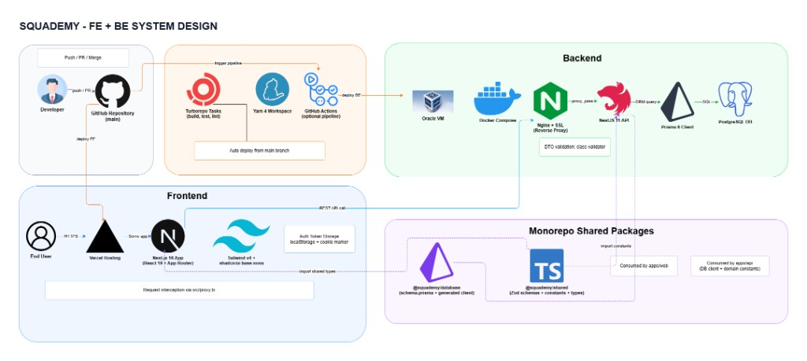

# Squademy

Community-driven English learning platform — monorepo with Next.js frontend, NestJS backend, and Prisma ORM.

## Architecture



| Package | Name | Stack | Purpose |
|---------|------|-------|---------|
| `apps/web` | @squademy/web | Next.js 16, React 19, Tailwind CSS v4, shadcn/ui | Frontend (Vercel) |
| `apps/api` | @squademy/api | NestJS 11, Passport JWT, class-validator | REST API (Oracle VM / Docker) |
| `packages/database` | @squademy/database | Prisma 6, PostgreSQL 16 | Schema, migrations, generated types |
| `packages/shared` | @squademy/shared | Zod v4, TypeScript | Shared schemas, types, constants |

**Monorepo tooling:** Yarn Workspaces 4 + Turborepo

**Auth model:** JWT access token (15min) + refresh token (7d). Tokens stored in localStorage on the client; a non-httpOnly `logged_in` cookie marker enables SSR auth redirects via `proxy.ts`. NestJS validates `Authorization: Bearer` on every API request.

## Prerequisites

- Node.js 20 LTS
- Yarn 4 (`corepack enable`)
- Docker + Docker Compose (for local PostgreSQL)

## Getting Started

```bash
# Install dependencies
yarn install

# Start PostgreSQL
docker compose up -d postgres

# Generate Prisma client + run migrations
yarn db:generate
yarn db:migrate

# Start all services (web :4000, api :4001)
yarn dev
```

## Environment Variables

Copy the example files and fill in secrets:

```bash
cp .env.example .env
cp apps/api/.env.example apps/api/.env
```

**Root `.env`** (used by `apps/web`):

| Variable | Description |
|----------|-------------|
| `API_URL` | NestJS API URL for server-side calls (e.g. `http://localhost:4001/api`) |
| `NEXT_PUBLIC_API_URL` | NestJS API URL for browser calls |
| `JWT_SECRET` | Shared with `apps/api` for proxy JWT checks |
| `CLOUDFLARE_R2_*` | R2 file storage credentials |
| `RESEND_API_KEY` | Transactional email |
| `CRON_SECRET` | Vercel Cron authorization |

**`apps/api/.env`**:

| Variable | Description |
|----------|-------------|
| `DATABASE_URL` | PostgreSQL connection string |
| `JWT_SECRET` | Access token signing secret |
| `JWT_REFRESH_SECRET` | Refresh token signing secret |
| `FRONTEND_URL` | CORS allowed origin |
| `PORT` | HTTP port (default `4001`) |

## Scripts

All scripts run via Turborepo from the root:

```bash
yarn dev          # Start web + api in parallel
yarn build        # Production build (all packages)
yarn lint         # ESLint across all packages
yarn test         # Jest across all packages
yarn db:generate  # Regenerate Prisma client + types
yarn db:migrate   # Apply pending Prisma migrations
```

Per-workspace scripts:

```bash
yarn workspace @squademy/web dev          # Next.js dev server (:4000)
yarn workspace @squademy/api dev          # NestJS watch mode (:4001)
yarn workspace @squademy/database db:studio  # Prisma Studio
```

## Testing

**Frontend (`apps/web`):** Jest + `next/jest` + Testing Library

```bash
yarn workspace @squademy/web test
yarn workspace @squademy/web test:watch
yarn workspace @squademy/web test:coverage
```

**Backend (`apps/api`):** Jest + `ts-jest`

```bash
yarn workspace @squademy/api test
yarn workspace @squademy/api test:watch
```

**Conventions:**
- Colocated tests: `src/**/*.test.ts(x)` next to source files
- Schema tests: `*-schema.test.ts` next to schema files
- Cross-cutting tests: `tests/**/*.test.ts(x)` at repo root

## Database

Schema lives in `packages/database/prisma/schema.prisma`. Single `User` model with auth + profile fields. Prisma generates TypeScript types consumed by both `apps/web` and `apps/api` via workspace protocol.

```bash
# Create a new migration
yarn workspace @squademy/database db:migrate

# Regenerate types after schema change
yarn db:generate

# Open Prisma Studio
yarn workspace @squademy/database db:studio
```

## Deployment

| Service | Provider | Plan |
|---------|----------|------|
| Frontend | Vercel | Free |
| Backend + DB | Oracle Cloud VM | Always Free (ARM, 4 cores, 24GB) |
| File Storage | Cloudflare R2 | Free (10GB/mo) |
| CDN | Cloudflare | Free |
| Email | Resend / Brevo | Free tier |

Production backend runs via Docker Compose behind Nginx + Let's Encrypt SSL.
