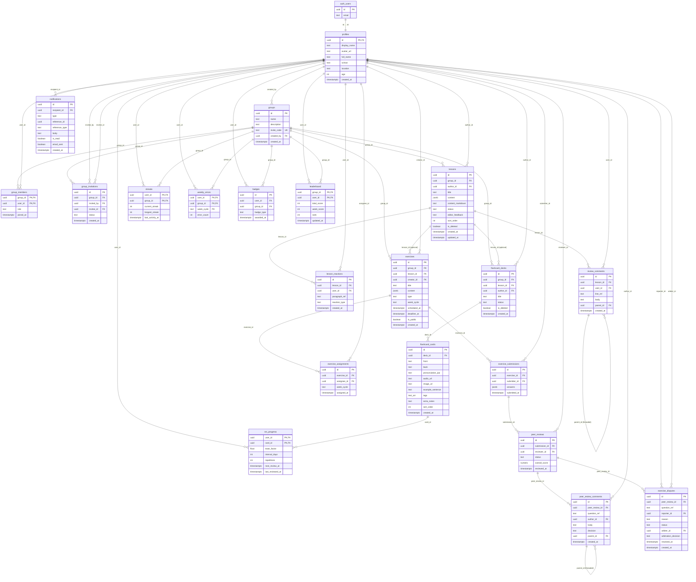
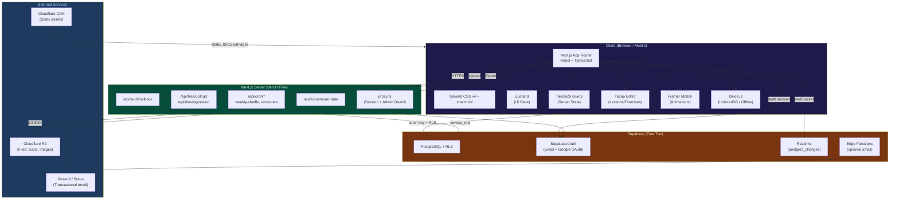
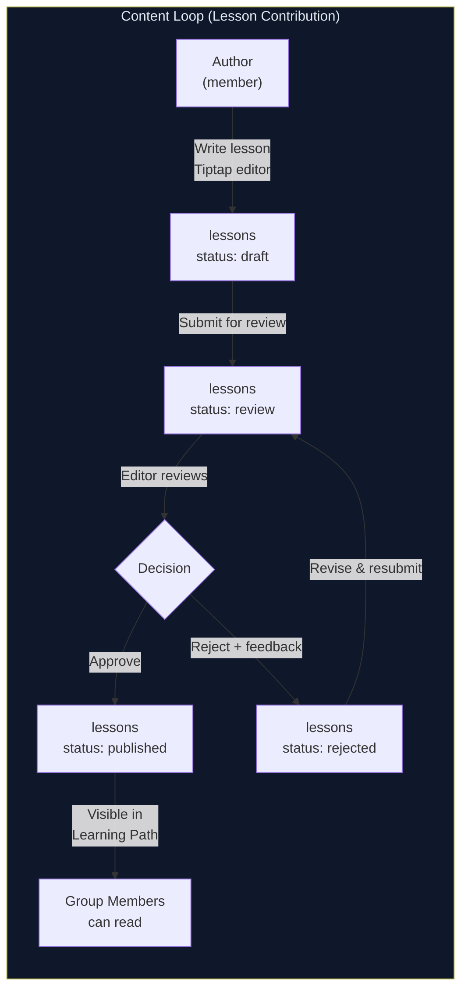
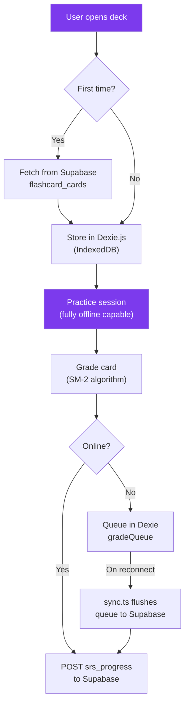
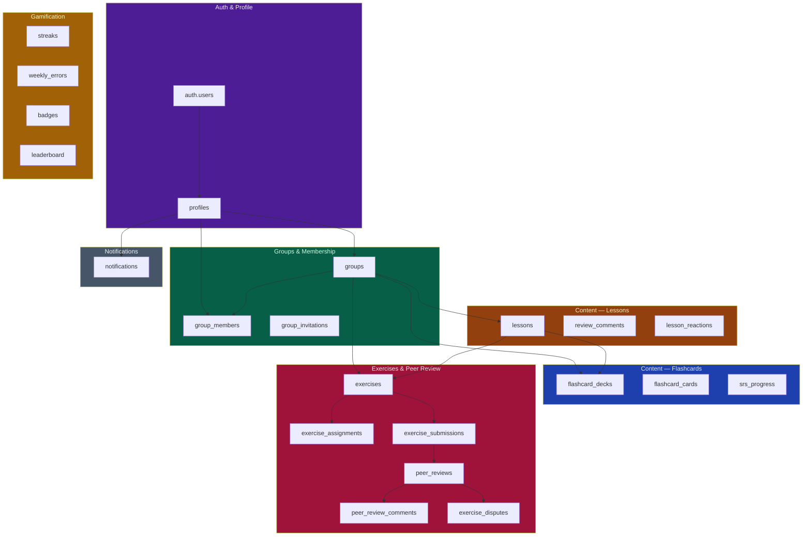
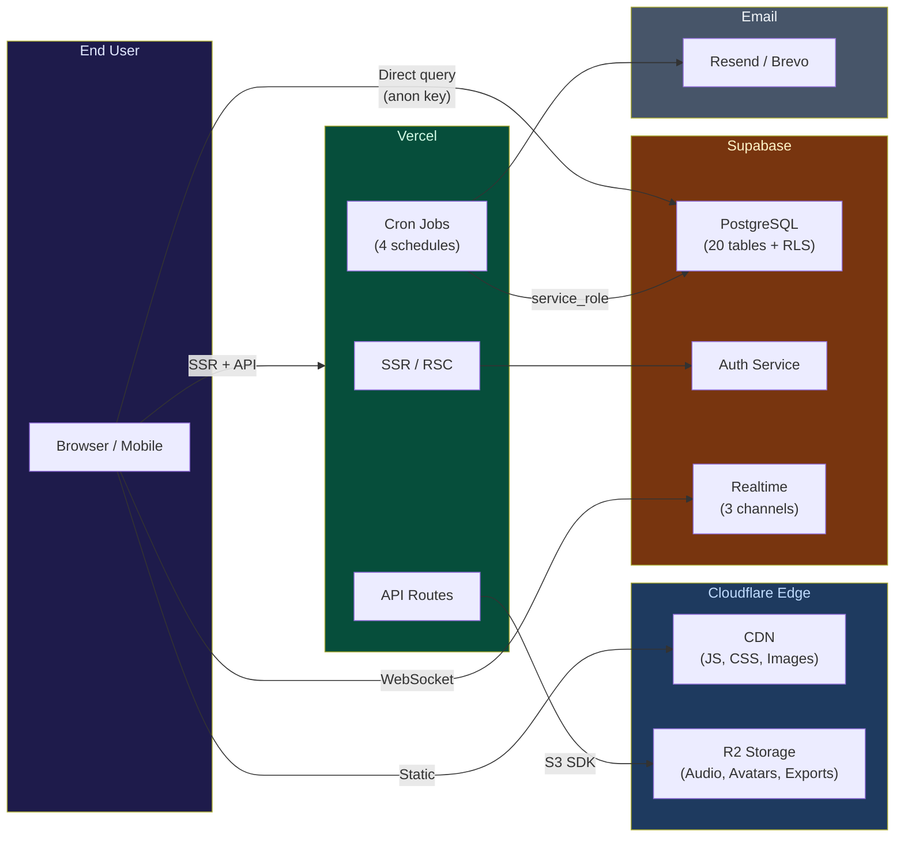

# Squademy — Architecture Diagrams

**Generated from:** architecture.md v2.0
**Date:** 2026-03-17

---

## 1. Database ER Diagram

---

## 2. System Architecture Diagram

---

## 3. Data Flow — Content Loop

---

## 4. Data Flow — Practice Loop (Exercise Lifecycle)

```mermaid
flowchart TD
    subgraph WeekCycle["Weekly Exercise Cycle"]
        M["Monday<br/>Cron: weekly-start"] -->|"Notify members"| A
        A["Members create<br/>exercises"] -->|"Submit by Saturday"| B["exercises table<br/>week_cycle: 2026-W11"]
        B -->|"Saturday 23:59<br/>Cron: weekly-shuffle"| C["Derangement<br/>Shuffle Algorithm"]
        C -->|"exercise_assignments"| D["Each member gets<br/>1 peer exercise"]
        D -->|"Complete & submit"| E["exercise_submissions"]
        E -->|"Creator grades"| F["peer_reviews<br/>+ peer_review_comments"]
        F -->|"Dispute?"| G{Agree?}
        G -->|"Yes"| H["Score recorded<br/>leaderboard updated"]
        G -->|"No"| I["exercise_disputes<br/>Editor arbitrates"]
        I --> H
        H -->|"Sunday 23:59<br/>Cron: weekly-close"| J["exercises.is_public = true<br/>Badges awarded"]
    end

    style WeekCycle fill:#0f172a,color:#e2e8f0
```

---

## 5. Data Flow — Flashcard Offline-First

---

## 6. Database Tables by Domain

---

## 7. Deployment Architecture

