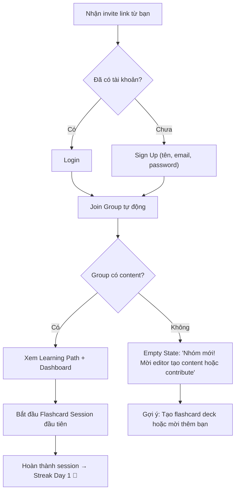
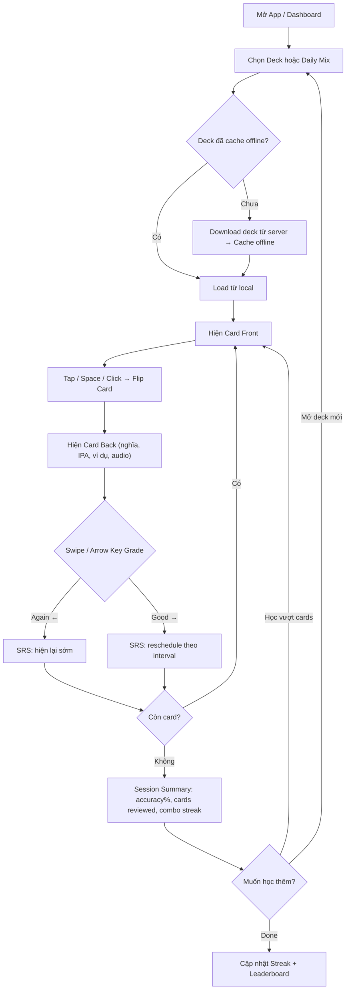
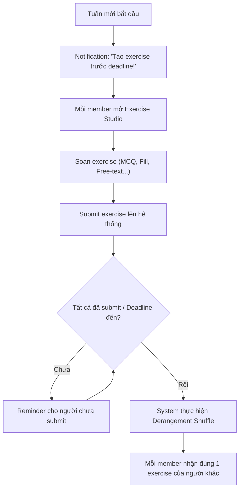
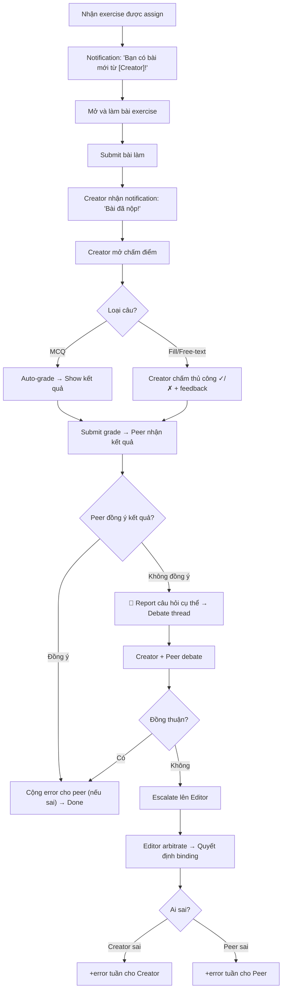
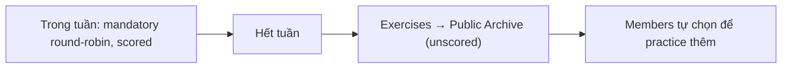
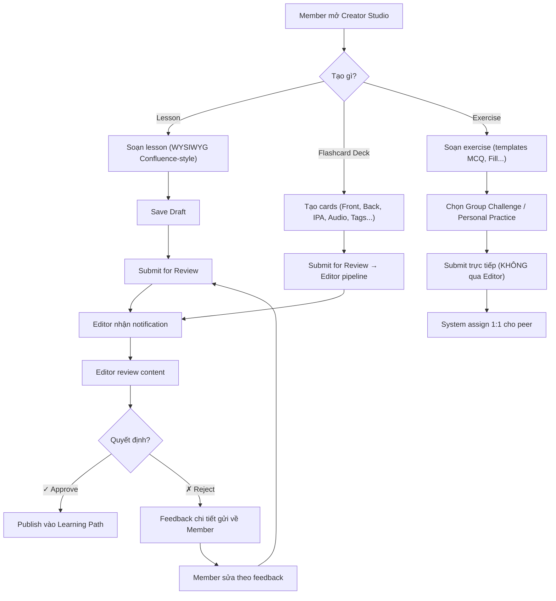
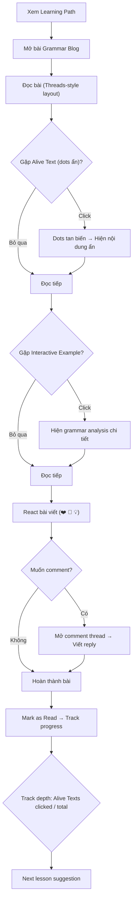

# UX Design Specification Squademy

**Author:** Mestor
**Date:** 2026-03-10T21:56:27+07:00

---

<!-- UX design content will be appended sequentially through collaborative workflow steps -->

## Executive Summary

### Project Vision

Squademy is a web-based, all-in-one English learning platform that transforms solitary study into a community-driven experience. By replacing fragmented tools with a unified ecosystem, it empowers users not just to consume curated content, but to actively create lessons and engage in reciprocal peer-review. This dual accountability loop—Content Creation and Practice Review—fosters long-term study discipline through deep asynchronous collaboration.

### Target Users

- **Students (15–24) & Young Professionals (25–35):** Self-studying English learners who need structured paths and accountability but find organizing live sessions exhausting.
- **Learners (Primary Role):** Users focused on consuming content, practicing via interactive exercises (flashcards, quizzes), and participating in peer reviews to reinforce their own knowledge.
- **Contributors (Secondary Role):** Engaged learners who step up to create and submit new lessons to enrich the group's curriculum.
- **Editors / Group Admins:** Knowledgeable group members responsible for curating content, ensuring quality, and managing group dynamics without being bottlenecked by synchronous communication.

### Key Design Challenges

- **Asynchronous Connection without Real-time Comm:** Building a deep sense of community and accountability (through peer reviews, streaks, leaderboards) entirely asynchronously, without relying on live video or chat.
- **Dual-role Interface Continuity:** Designing a seamless transition for users who fluidly switch between consuming (learning) and creating (contributing/reviewing) within the same session.
- **Editor Efficiency:** Creating highly efficient, line-level review interfaces for Editors to review, approve/reject, and comment on peer submissions without causing burnout or bottlenecks.

### Design Opportunities

- **Gamification as a Retention Tool:** Leveraging streaks, interactive leaderboards, and contributor badges to transform routine study into an engaging, self-reinforcing habit loop.
- **"Tinder-style" Micro-interactions:** Designing intuitive, mobile-first swipe mechanics for flashcards and quick exercises to reduce cognitive load and make learning feel effortless and modern.
- **GitHub-style Collaborative Learning:** Applying beloved developer collaboration patterns (Draft → Review → Publish, line-level threaded debates) to language education, creating a novel and highly transparent learning environment.

## Core User Experience

### Defining Experience

The core defining experience of Squademy is the **Dual-Role Learning Loop**, governed by **Enforced Reciprocity**. Users must feel that transitioning from a passive "consumer" of flashcards to an active "evaluator" of a peer's work is not only natural but necessary. The heartbeat of the platform isn't just finishing an exercise; it's the reciprocal exchange of knowledge. The most critical action is completing a practice session and engaging in a peer-review swap to secure one's own progress.

### Platform Strategy

Squademy is a hybrid SPA/MPA Web Application designed with a strict **Mobile-First paradigm**.

- **Touch-Optimized:** Because learning often happens on the go in short bursts, primary interactions (like flashcard study) must support mobile touch gestures (swiping).
- **Graceful Scaling:** While mobile is prioritized for consumption and practice, the "Content Studio" (for lesson creation and deep editorial review) must gracefully scale up to leverage the full screen real estate of tablets and desktop environments.
- **Chrome Optimization:** MVP is optimized strictly for modern Chrome browsers (latest 2 versions).
- **Asynchronous Batch Processing:** To meet the zero-OPEX constraint while delivering sub-200ms interactions, the frontend handles pre-fetched batches of content offline and syncs states/results to the server asynchronously.

### Effortless Interactions

To ensure users stay in a flow state, the following interactions must be completely frictionless:

- **Tinder-Style Flashcards:** Swiping left/right to indicate retention without needing to find or tap small text buttons.
- **Seamless Flow Continuity:** Moving from completing an exercise straight into reviewing a peer's exercise, driven by contextual triggers (e.g., streak completion screens).
- **Macro-Assisted Creation:** Contributors generating quizzes from existing flashcard tags in one click, eliminating redundant data entry.

### Critical Success Moments

These are the "make-or-break" moments that will determine if a user retains:

- **The "I'm Not Alone" Moment:** When a user receives their first piece of specific, line-level feedback from a peer. This proves the system works.
- **The "High-Stakes Accountability" Moment:** When a user realizes that failing to review a peer's work within 7 days actively harms their own score.
- **The "My Work Matters" Moment:** When a contributor receives a notification that their lesson draft was approved by the group Editor and is now live for everyone.
- **The "Habit Formed" Moment:** When a user hits their 7-day streak, unlocking a badge and seeing their name rise on the group leaderboard.

### Experience Principles

- **Frictionless Asynchrony:** Collaboration should feel as lightweight as social media interactions, despite being purely asynchronous, enabled by batch-loaded, instantaneous UI responses.
- **Pedagogy through Peer Review:** Position evaluating others NOT as a chore, but as the final, most advanced step of learning a concept, directly tied to the reviewer's mastery progression.
- **Enforced Reciprocity:** Gamified accountability with teeth. Failing to review peers incurs a penalty equivalent to the exercise size, processed via regular end-of-week cron jobs.
- **Earned Trust:** The Editor acts as the quality gatekeeper, ensuring that community-generated content feels as reliable as a textbook.

## Desired Emotional Response

### Primary Emotional Goals

- **Sự làm chủ Đa năng (All-in-One Empowerment):** Người dùng cảm thấy họ đang sở hữu một "hệ sinh thái" học tập toàn diện, nơi mọi công cụ cần thiết đều có sẵn, thay vì phải chuyển đổi qua lại giữa nhiều nền tảng.
- **Tinh thần Cộng đồng Tích cực (Healthy Community Connection):** Một môi trường vừa an toàn để luyện tập, vừa có tính thử thách cao để các thành viên thúc đẩy nhau tiến bộ. Sự cọ xát góc nhìn khơi dậy sự giao lưu mang tính học thuật.

### Emotional Journey Mapping

- **Mở ứng dụng (App Opening):** Sự tò mò và hứng thú (Interesting & Engaging). Trải nghiệm bắt đầu dễ dàng, mượt mà khiến việc học có tính gây nghiện (addictive flow) giống như đang chơi game.
- **Quá trình Luyện tập (Flashcard/Exercise):** Sự tập trung cao độ (Flow state) nhờ thao tác không độ trễ. Quệt xong một batch sẽ mang lại cảm giác thỏa mãn tức thì ("Mình đã hoàn thành nhiệm vụ hôm nay").
- **Nhận và Chấm bài (Peer-Review Loop):**
  - *Tò mò trí tuệ & Cạnh tranh lành mạnh (Intellectual Curiosity & Competitive Camaraderie):* Kích thích sự tò mò đi research thêm tài liệu để bảo vệ hoặc phản biện một quan điểm, nảy sinh cảm giác "hơn thua" dựa trên kiến thức.
  - *Sự trọn vẹn chuyên nghiệp (Professional Fulfillment):* Cảm giác hoàn thành một trách nhiệm nghiêm túc, mang hơi hướng học thuật (giống như peer-review các bài báo khoa học trong hội nghị), tạo ra giá trị thực sự cho người khác và hệ thống.

### Micro-Emotions

- **Tự hào Cá nhân (Personal Pride) vs. Thuộc về Tập thể (Belonging):** Người dùng tự hào về streak, điểm số cá nhân, nhưng đồng thời cảm nhận sâu sắc vai trò không thể thiếu của mình trong mạng lưới tri thức của cộng đồng thông qua việc chấm bài. Sự tự hào này được củng cố khi nhận diện và sửa lỗi sai cho người khác.
- **Gây nghiện, Dễ Dàng (Addictive Flow) vs. Trách nhiệm (Duty):** Tương phản thú vị giữa sự thoải mái khi lướt flashcard tốc độ cao và sự nghiêm túc, có tính cam kết khi phải hoàn thành deadline review hàng tuần để bảo toàn điểm số.

### Design Implications

- **Sự làm chủ Đa năng:** Dashboard trực quan, nhóm các công cụ học tập thông minh để người dùng không bị ngợp.
- **Trạng thái Gây nghiện Đa nền tảng:**
  - *Mobile/iPad:* Thao tác vuốt (swipe) mượt mà, thẻ cong nhẹ ở góc và mờ dần tạo cảm giác vật lý.
  - *Laptop/Desktop:* Sử dụng **Bàn phím như Tay cầm chơi game** (Keyboard Controller). Dùng phím Space để lật thẻ, phím Mũi tên trái/phải để chuyển thẻ, kết hợp với hiệu ứng thị giác (thẻ trượt mượt mà theo hướng phím bẩm) tạo cảm giác vuốt vật lý giả lập.
- **Gia vị Tương tác (Juice) — FR30b:**
  - *Sound Design (Web Audio API):* Tiếng sột soạt nhẹ (lật thẻ), tiếng "Ding" thanh mảnh (Good), tiếng "Tuk" trầm (Again), tiếng chime khi đạt streak milestone, tiếng kính vỡ nhẹ khi mất combo. Âm thanh được preload vào AudioBuffer pool khi user mở Practice session. User có thể tắt/bật trong Settings (`uiStore.soundEnabled`).
  - *Hiệu ứng Streak:* Viền thẻ phát sáng (glowing) hoặc confetti lấp lánh nhẹ nhàng khi đạt combo trả lời đúng.
  - *Haptic Feedback (Mobile — Vibration API):* Rung cực nhẹ `navigator.vibrate([10])` lúc lật thẻ, rung dứt khoát `navigator.vibrate([30])` khi thẻ bay đi. Tự động no-op trên thiết bị không hỗ trợ. Có toggle bật/tắt trong Settings.
- **Phân tách Ranh giới Thị giác (Visual Boundaries):**
  - *Khu vực Practice:* UX bo góc, tươi sáng, một chạm.
  - *Khu vực Review:* UI tĩnh lặng, tập trung, font chữ Serif cho bài viết, tạo cảm thái độ làm việc học thuật chuyên nghiệp. Các luồng (threaded) tranh luận cần cho phép Cite (trích dẫn nguồn) dễ dàng.

### Emotional Design Principles

- **Khởi đầu nhẹ nhàng, Gắn kết sâu sắc (Effortless Entry, Rigorous Engagement):** Bắt đầu phiên học phải dễ dàng như chơi game, tận dụng pre-load 100% tài nguyên để tương tác dưới 50ms, kể cả khi rớt mạng. Nhưng giai đoạn peer-review sẽ đòi hỏi sự đầu tư trí tuệ cao hơn.
- **Tự hào Quá trình, Thuộc về Kết quả (Pride in Process, Belonging in Result):** Game hóa nỗ lực nạp kiến thức cá nhân, nhưng neo giữ thành quả cuối cùng vào sự đánh giá của cộng đồng (luật Enforced Reciprocity).
- **Ma sát Tích cực (Constructive Friction):** Giao diện luyện tập thì không độ trễ, nhưng quy trình chấm bài thì cố tình thiết kế những khoảng "dừng" để kích thích suy nghĩ, research và tranh luận học thuật.

## UX Pattern Analysis & Inspiration

### Inspiring Products Analysis

- **TikTok / Threads / YouTube Shorts:**
  - *Sức hút:* Khả năng định hình thói quen nhờ thuật toán đề xuất nội dung liên tục (Addictive Progression).
  - *Thiết kế:* Giao diện nhập vai toàn màn hình (Full-screen immersion), nội dung là trung tâm, các nút tương tác vuốt chạm được tối ưu cho ngón cái.
- **ChatGPT / Gemini:**
  - *Sức hút:* Cung cấp chính xác điều người dùng cần mà không gây phân tâm.
  - *Thiết kế:* Focus hoàn toàn (Khung nhập liệu là trung tâm), triệt tiêu các menu thừa thãi, giao diện tối giản tuyệt đối.
- **Facebook:**
  - *Sức hút:* Tạo cảm giác cộng đồng sống động thông qua phản hồi thời gian thực (Real-time feedback) như Notification, Like, Comment.

### Transferable UX Patterns

**1. "Daily Mix" Addictive Progression (Từ TikTok/Spotify):**

- Thay vì bắt người dùng tự thiết lập phiên học, hệ thống (dựa trên thuật toán Spaced Repetition) sẽ tự động tạo một "Daily Mix" (gói Flashcard/Bài tập trong ngày) ngay trên màn hình chính. Cảm giác ma sát để bắt đầu học gần như bằng 0 - chỉ cần nhấn Play và Swipe.

**2. Content-Centric Minimalist UI (Từ ChatGPT):**

- Trong màn hình **Review (Chấm bài)**, áp dụng nguyên tắc "Sự tập trung (Focus)". Ẩn toàn bộ thanh điều hướng (Navigation bar), tab menu. Màn hình chỉ hiển thị: Bài làm của bạn bè và khung nhập nhận xét của người dùng.

**3. Frictionless Core Action:**

- Thao tác phải đạt mức "bản năng" (Instinctive). Vuốt thẻ 1 chạm trên Mobile. Trên Laptop, sử dụng Keyboard Controller (Phím Space, Mũi tên) kết hợp với phản hồi chuyển động màn hình để mô phỏng cảm giác vuốt vật lý.

**4. Khởi tạo "Sự sống động" (Từ Facebook/Threads):**

- Dù hệ thống là Asynchronous, vẫn rải rác các thông báo nhỏ (Information Snippets) tinh tế góc màn hình (VD: *"Tí vừa vượt qua điểm số của bạn"* hoặc *"Bài review của bạn vừa được thả tim"*) để tạo cảm giác cộng đồng đang hoạt động theo thời gian thực (Real-time feedback giả lập).

### Anti-Patterns to Avoid

- **The "Facebook" Overload (Bị ngợp thông tin):** Dashboard không được biến thành một mớ hỗn độn của bảng xếp hạng, thông báo và bài tập. Cần chắt lọc hiển thị 1 Call-to-action quan trọng nhất (VD: Nhiệm vụ Review đến hạn).
- **Endless Scrolling (Vuốt không có điểm dừng):** Khác với giải trí, việc học cần điểm dừng để tạo Cảm giác Hoàn thành (Sense of Completion). Cơ chế chỉ cho phép vuốt theo các Batch nhỏ (Micro-batches).
- **Complex Navigation:** Bắt người dùng click quá 3 lần từ lúc mở app đến lúc bắt đầu học là một thiết kế thất bại.

### Design Inspiration Strategy

**What to Adopt:**
- Giao diện Focus Tối giản của ChatGPT cho chế độ Content Studio và Review.
- Giao diện Card-based UI tối ưu ngón cái của TikTok cho chế độ Practice.

**What to Adapt:**
- Biến tấu cơ chế Đề xuất giải trí thành Thuật toán Đề xuất Học tập (SRS) được đóng gói dưới dạng "Daily Mix".
- Chuyển thể mô hình Thread Comment của Mạng xã hội thành luồng Bình duyệt (Peer-review) chuyên sâu, học thuật.

**What to Avoid:**
- Tránh xa bố cục nhiều cột (Multi-column) gây xao nhãng. Mọi thông báo xuất hiện đều phải gắn với một Nhiệm vụ (Actionable).

## Design System Foundation

### Design System Choice

**Themeable System (Hệ thống có thể tùy biến Theme)**
Cụ thể: **Hệ sinh thái Tailwind CSS kết hợp với Shadcn/UI (trên nền tảng React/Next.js hoặc Vue/Nuxt.js)**.

### Rationale for Selection

- **Tốc độ làm MVP vượt trội (Speed to MVP):** Tái sử dụng các High-quality Components (Nút bấm, Dialog, Thẻ) đã được xây dựng chuẩn mực về tính năng và Accessibility (Khả năng truy cập) từ Shadcn/UI. Giúp team Dev không phải "phát minh lại bánh xe".
- **Kiểm soát mã nguồn 100% (Future-proofing):** Không giống như các Component Library truyền thống (Bootstrap, Material), Shadcn/UI copy source code trực tiếp vào dự án. Squademy sở hữu quyền sinh sát đối với mọi dòng code UI, giúp dễ dàng tích hợp các logic Animation phức tạp sau này mà không bị "khóa" (Vendor lock-in) bởi thư viện bên thứ 3.
- **Micro-interactions (Tương tác Vi mô):** Tailwind UI nổi tiếng với khả năng xây dựng các hiệu ứng như Glassmorphism (Kính mờ phủ nhẹ), Glowing (Ánh sáng tỏa), hay các nhịp điệu chuyển động cực mượt (Fluid Animation). Đáp ứng hoàn hảo yêu cầu giao diện "Cực kỳ hiện đại, mượt mà và Gây nghiện" do người dùng đề xuất.

### Implementation Approach

1. **Khởi tạo Framework:** Khởi tạo project với bộ khung Frontend framework đã chọn (React.js/Next.js).
2. **Cài đặt Design Tokens:** Định nghĩa bảng màu cơ bản (Primary, Secondary, Accent, Error, Warning, Success), hệ thống Typography thống nhất, spacing system (Hệ thống lưới khoảng cách) thông qua file cấu hình `tailwind.config.js`.
3. **Bring-Your-Own-Components (Mang Component của bạn lại đây):** Import các base component từ Shadcn/UI theo đường "cần tới đâu lấy tới đó" (A la carte), giúp bundle size siêu nhẹ.
4. **Layout & Container:** Chốt cấu trúc Layout theo hướng Mobile-first. Xây dựng một Responsive Container trung tâm, tự động thích ứng khung nhìn từ Mobile -> Tablet iPad -> Desktop Laptop.

### Customization Strategy

- **Practice Mode (Chế độ Học vẹt Flashcard):** Chế tác lại Component "Card" từ Shadcn/UI thành một thẻ tương tác "Vuốt" đa chức năng. Thêm biến chuyển đổi 3D (Transform 3D) qua Tailwind cho hiệu ứng quẹt mượt. Gắn Animation phản hồi mạnh ngay lập tức (Xanh Lóa khi học đúng, Đỏ Lắc lư khi học sai).
- **Review Mode (Chế độ Chấm bài The Focus):** Tùy chỉnh Layout gốc của hệ thống, xây dựng một biến thể "Distraction-free" (Không xao nhãng) với toàn bộ Navigation Bar bị ẩn, chỉ chừa lại duy nhất không gian nội dung (bắt chước giao diện Tập trung của ChatGPT).
- **Gamification Elements:** Tùy biến các Badge (Huy hiệu), Progress Bar (Thanh tiến trình), Streak Counter (Điểm chuỗi) từ thư viện gốc bằng cách thêm lớp bóng đổ (Shadow glow) và viền Neon tinh tế.

## Defining Experience Mechanics

### 1. Defining Experience (Trải nghiệm Định hình)

- **Vòng lặp Học tập Không điểm mờ (The Frictionless Learning Loop):** Sự mượt mà trong việc chuyển đổi giữa 3 trụ cột (Tạo Content -> Practice -> Review). Mỗi tính năng đều có cơ chế gây nghiện riêng nhưng nằm chung trong một vòng lặp gắn kết sinh tồn.
- **Hấp thụ Ngữ pháp Gây nghiện (Addictive Grammar Consumption):** Biến một bài blog đọc tĩnh thành một trải nghiệm khám phá tương tác và mang tính cộng đồng sâu sắc.

### 2. User Mental Model (Mô hình Tâm lý)

- **Bây giờ:** Học viên mệt mỏi vì phân mảnh ứng dụng (Notion để viết, Anki để học, Facebook để hỏi). Đọc blog ngữ pháp thì buồn ngủ và thụ động.
- **Với Squademy:** Cảm nhận việc học được đóng gói chặt chẽ: "Tất cả những gì tôi cần để xuất sắc đều nằm sẵn ở đây, và chúng được kết nối tự động với nhau. Thậm chí đọc một bài ngữ pháp dài cũng thú vị và nhộn nhịp như đang lướt Threads".

### 3. Success Criteria (Tiêu chí Thành công)

- **Zero-Friction Context Switching:** Thời gian chuyển đổi giữa các Mode dưới 1 giây.
- **Active Consumption:** Tỷ lệ người dùng đọc hết bài blog ngữ pháp tăng cao nhờ tính tò mò (tương tác với text) và cảm giác có người đồng hành (đọc comment bên lề).
- **The "Domino Effect":** Kết thúc một chế độ học tập luôn mở ra một Call-to-Action (Nút điều hướng) hiển nhiên, mời gọi bước sang hành động tiếp theo vô cùng tự nhiên.

### 4. Novel UX Patterns (Các Mẫu UX Mới)

- **Alive Text (Văn bản Sống động / Trứng Phục Sinh):** Những điểm ngữ pháp trọng tâm hoặc câu chốt trong bài Blog bị "lớp phủ" che đi. Người dùng phải tương tác (chà xát trên màn hình cảm ứng hoặc rê/click chuột) để chữ hiện ra rực rỡ, tạo sự tò mò và tập trung cao độ.
- **Social Hotspots (Điểm nóng Cộng đồng):** Hiển thị các Reaction (Thả tim, Phấn nộ) và Highlight của cộng đồng ngay bên cột lề (margin) của mỗi đoạn văn, mô phỏng trải nghiệm đọc Medium kết hợp Threads, triệt tiêu sự cô đơn khi tự học.
- **Khóa Sinh tồn (Enforced Reciprocity):** Lần đầu tiên, một hệ thống ép người dùng phải chuyển từ trạng thái Tiêu thụ sang trạng thái Đóng góp (Chấm bài/Tạo bài) như một nhiệm vụ sinh tồn tích điểm.

### 5. Experience Mechanics (Cơ chế Trải nghiệm)

**1. Initiation (Khởi tạo):** 
- Từ màn hình chính, người dùng bấm "Daily Mix" (Vào Practice) hoặc chọn đọc bài Grammar. Nút "+" (Tạo flashcard/bài tập) luôn lơ lửng trên giao diện.
**2. Interaction (Tương tác):**

- *Practice Mode:* Thao tác bản năng Vuốt trái/phải, kèm Combo Multiplier (Nhân điểm khi đúng liên tiếp).
- *Grammar Reading Mode:* Vuốt dọc để đọc, click/chà xát để mở khóa text ẩn (Alive Text), nhấn vào lề để xem/thêm Reaction/Comment của bạn bè (Social Hotspots).
- *Review Mode:* Layout tĩnh lặng, không xao nhãng. Giao diện như các "Hợp đồng Săn tiền thưởng" (Bounty Contracts).
**3. Feedback (Phản hồi):**
- Ngay lập tức: Âm thanh vui tai ("Đinh!" khi làm đúng, "Kính vỡ" khi mất chuỗi Combo), màu sắc thẻ biến đổi, reaction hiện lên tức thì.
- Trì hoãn: Thông báo Reputation tăng nhờ người khác xài Flashcard của mình, thông báo có điểm Review.
**4. Completion (Hoàn thành):**
- Kết thúc một chu trình luôn là bảng Tóm tắt Thành tựu (Summary) rực rỡ, kèm Shortcut chuyển ngay sang Mode tiếp theo. (Ví dụ: Đọc xong Grammar -> Nút Shortcut "Tạo Flashcard từ bài này ngay!").

## Visual Design Foundation

### Color System

**Brand Core:** Electric Purple (`#7C3AED`), Teal (`#0D9488`), và Pink (`#EC4899`) làm màu chủ đạo.
**Theme Support:** Toàn bộ hệ thống hỗ trợ song song hai chế độ **Light Mode** và **Dark Mode** mặc định, cho phép người dùng tùy chọn trải nghiệm sáng/tối theo sở thích và thời gian học trong ngày.
**Contextual Theming (Màu sắc theo Ngữ cảnh):**
- **Light Mode:** Nền xám ngà (`bg-zinc-50`), thẻ trắng tinh (`bg-white`), viền mỏng (`border-zinc-200`), chữ xám đen (`text-zinc-900`). Mang lại cảm giác sạch sẽ, tập trung và cao cấp.
- **Dark Mode:** Nền xám đen sâu (`bg-zinc-950`), thẻ xám đậm (`bg-zinc-900`), viền tối (`border-zinc-800`), chữ xám sáng (`text-zinc-100`). Giảm mỏi mắt nhưng vẫn giữ được chiều sâu (depth) cho giao diện.
- **Semantic Colors:** Xanh ngọc lục bảo (`emerald-500`) cho Success/Correct, Hổ phách/Cam (`amber-500`/`orange-500`) cho Warning/Streak, Đỏ (`red-500`) cho Error/Incorrect. Các màu này được làm mềm đi bằng cách dùng nền nhạt (ví dụ: `bg-emerald-50` ở Light Mode và `bg-emerald-500/10` ở Dark Mode).

### Typography System

Định dạng đa phong cách (Multi-personality Typography) tùy thuộc vào ngữ cảnh sử dụng:
- **Playful Display (Tiêu đề & Giao diện chung):** Sử dụng `Nunito`. Sự bo tròn của font chữ tạo cảm giác hiện đại, năng động, giảm bớt áp lực "đang phải học".
- **Social Reading (Nội dung đọc & Blog Grammar):** Sử dụng `Inter`. Định dạng Sans-serif tiêu chuẩn giúp trải nghiệm đọc văn bản dài trở nên trơn tru và dễ chịu nhất.
- **Serious Focus (Code & Trích dẫn):** Sử dụng `Fira Code` hoặc các font Monospace cho các đoạn trích dẫn, phím tắt (keyboard hints). Sự vuông vức, sắc bén kích hoạt tư duy phân tích và làm việc nghiêm túc.

### Spacing & Layout Foundation

- **Practice/Home:** Khối lớn, Padding rộng rải rác xung quanh để tối ưu cảm ứng (Touch-friendly), giao diện nổi bật dạng thẻ (Card-based).
- **Grammar Blog:** Layout cột giữa (Single-column centered), độ rộng tối ưu đọc hiểu (600px - 700px). Không gian hai bên margin được dùng làm túi chứa các Reaction và Comment (Social Hotspots).
- **Review/Create:** Layout Toàn màn hình (Full-width / Split View), tận dụng tối đa diện tích màn hình để soi lỗi và đối chiếu. Mật độ thông tin dày đặc (Dense layout) kiểu bảng điều khiển.

### Accessibility Considerations

- **Độ Tương Phản (Contrast Ratios):** Đảm bảo tỷ lệ tương phản đạt chuẩn WCAG (AAA) trên cả hai chế độ Light Mode và Dark Mode.
- **Scale-able Typography:** Hỗ trợ cài đặt kích cỡ chữ động (Dynamic Type) cho ứng dụng di động, đặc biệt quan trọng để chống mỏi mắt khi đọc Blog Grammar.

---

## Step 9: Design Directions

### Brand Identity

- **Logo:** Icon thể hiện nhóm người (squad) tạo hình dáng hướng lên (growth) kết hợp mũ tốt nghiệp (academy), sử dụng bảng màu thương hiệu (Purple, Teal, Pink). Xem logo tại `ux-design-directions.html` và file logo generate.
- **Tagline:** "Learn English Together."
- **Icon System:** Lucide React — đồng nhất, hiện đại, nét thanh mảnh, không dùng emoji.

### Design Directions — Interactive Mockups

File HTML mockup: [`ux-design-directions.html`](./ux-design-directions.html)

### Zone 1: Practice (Flashcard Flip)

- **Cơ chế Flip:** Tap/Click/Space để lật thẻ → Swipe/Arrow Keys để chấm điểm.
- **Anti-mistouch Design:** Vùng giữa thẻ = Flip, vùng trái/phải = Swipe Grade. Phím ← → bị disabled cho đến khi thẻ đã lật.
- **Mobile:** Thẻ bo tròn lớn, nút ✗/✓ xuất hiện SAU khi lật. Combo streak hiển thị nổi bật.
- **Desktop:** Thẻ rộng hơn, Keyboard Hints (← Again | Space Flip | → Good) hiển thị phía dưới.

### Zone 2: Grammar Blog (Alive Text + Social Hotspots)

- **Alive Text:** Nội dung ẩn được che bởi **animated dots kiểu Threads** (chấm tím nhấp nháy). Click để tan biến và hiện chữ gốc.
- **Interactive Example:** Click vào câu ví dụ để hiện phân tích ngữ pháp dạng pill tags.
- **Social Hotspots:** Mỗi đoạn văn có viền trái khi hover, nút Reaction (❤️ 🤔) và Comment (💬 + badge) lơ lửng bên lề. Thread comment inline ngay dưới đoạn.

### Zone 3A: Review — Premium Minimalist

- **Lesson Review:** Từng section trong khung sq-card, nút Comment và Suggestion inline. Nút chính: ✗ Request Changes / ✓ Approve & Publish.
- **Exercise Review (Quiz Grading):** MCQ hiển thị **TẤT CẢ đáp án** (không chỉ đáp án đúng). Câu tự chấm (MCQ) có tag Auto-graded. Câu cần peer-review (Fill, Free-text) có nút ✓ Correct / ✗ Incorrect + ô feedback.

### Zone 3B: Creator Studio

- **Flashcard Creator:** Form đầy đủ trường Anki: Front, Back, Pronunciation (IPA), Audio (Upload/Record), Example, Image, Tags, Extra Notes.
- **Lesson Creator:** Thanh công cụ Confluence-style ưu tiên **text formatting** (B I U S | H1 H2 H3 | Lists Quote | Link Image Table | Alive Text | Quiz Block). Sidebar Outline + Notion-style editor.
- **Exercise Creator:** Thanh công cụ Confluence-style ưu tiên **question templates** (MCQ | Fill Blank | Free Text | True/False | B I Link Image). Mỗi câu hỏi có header gradient nhãn màu riêng + nút xóa.

### Zone 4: Learning Path Roadmap Editor (Editor-Only)

- **Route:** `/group/[groupId]/roadmap` — chỉ hiện trong menu cho Editor/Admin.
- **Layout:** Single-column danh sách kéo thả (drag-and-drop). Mỗi item là một `sq-card` nhỏ gọn hiển thị: icon loại (lesson/flashcard), tiêu đề, tác giả, status pill (Published/Draft).
- **Tương tác:** Kéo thả để sắp xếp thứ tự bài giảng và flashcard deck thành lộ trình tuần tự. Nút "Add to Path" để thêm bài đã published vào lộ trình. Nút "Remove" (ghost) để gỡ khỏi lộ trình (không xóa nội dung).
- **Auto-save:** Thứ tự được lưu tự động sau mỗi thao tác kéo thả (optimistic UI update).
- **Mobile:** Danh sách dọc, nút "Move Up / Move Down" thay thế kéo thả trên màn hình nhỏ.
- **Desktop:** Drag handle bên trái mỗi item, preview panel bên phải hiện nội dung tóm tắt khi hover.

### Zone 5: Personal Profile — Activity Heatmap

- **Vị trí:** Màn hình cá nhân (`/settings` hoặc profile page), phía trên thống kê tổng quan.
- **Thiết kế:** Lưới 52 tuần (12 tháng gần nhất) dạng GitHub Contribution Calendar. Mỗi ô vuông nhỏ đại diện 1 ngày.
- **Bảng màu:** Cường độ dựa trên `total_actions`:
  - 0 actions: `zinc-200` (light) / `zinc-800` (dark)
  - 1–2 actions: `emerald-200` / `emerald-900`
  - 3–5 actions: `emerald-400` / `emerald-700`
  - 6+ actions: `emerald-600` / `emerald-500`
- **Hover tooltip:** "15 Mar 2026: 4 flashcards, 1 exercise, 1 review"
- **Responsive:** Desktop hiển thị đầy đủ 52 tuần. Mobile thu gọn thành 3 tháng gần nhất + nút "Show more".
- **Motivational text:** Dưới heatmap hiện "Current streak: 12 days" + "Longest streak: 28 days".

### Unified Design DNA

- **Hệ thống Component chung:** `sq-card`, `sq-btn`, `sq-input`, `pill` — cùng border-radius (14px), cùng shadow, cùng spacing rhythm, cùng hover effect trên MỌI zone.
- **Khác biệt chỉ ở màu accent:** Purple (Practice), Teal (Blog), Neutral/Dark (Studio/Review).
- **Trạng thái đồng nhất:** Tất cả trạng thái (Pending, Grading, Draft, Correct, Incorrect) sử dụng chung hệ pill badges màu đồng nhất.

---

## Step 11: Component Strategy

### Editor Library

**Tiptap (Free/Community edition)** — Rich-text editor cho Lesson Creator & Exercise Creator.

- **Lý do:** Headless, extensible, dựa trên ProseMirror. Không cần collaborative editing (chỉ contributor chỉnh sửa, members comment/suggest riêng).
- **Sử dụng:** Confluence-style toolbar (B I U S | H1-H3 | Lists Quote | Link Image Table | Alive Text | Quiz Block).
- **Không dùng:** Real-time collaborative editing (Y.js, Liveblocks). Workflow là Draft → Submit → Editor review (async, kiểu GitHub PR).

### Animation Library

**Framer Motion** — Layout & gesture animations cho React.

- **Sử dụng:** FlashcardFlip 3D animation (rotateY), swipe gesture (drag + spring), Alive Text dots dissolve, page transitions, micro-interactions (hover, press feedback).
- **Không dùng:** Canvas/WebGL-based animation (quá nặng cho MVP offline-first).

### Offline Storage

**Dexie.js** — IndexedDB wrapper cho offline-first data.

- **Sử dụng:** Cache flashcard decks offline, queue grade results khi mất mạng, sync khi online.
- **Pattern:** Download batch → store in Dexie → practice offline → sync results khi reconnect.

### Light/Dark Mode — Adaptive Theming

**Tailwind CSS v4** với `@custom-variant dark (&:where(.dark, .dark *));` để ép class strategy.

| Token | Dark Mode | Light Mode |
| ----- | --------- | ---------- |
| Background | `zinc-950` | `zinc-50` |
| Card/Surface | `zinc-900` | `white` |
| Border | `zinc-800` | `zinc-200` |
| Text Primary | `zinc-100` | `zinc-900` |
| Text Secondary | `zinc-400` | `zinc-500` |
| `--sq-green` | `emerald-400` / `emerald-500` | `emerald-500` / `emerald-600` |
| `--brand-purple` | `purple-400` | `purple-600` / `#7C3AED` |
| `--streak-text` | `orange-400` | `amber-700` |

- **Zone backgrounds** tự động switch nhờ các utility classes của Tailwind (`bg-zinc-50 dark:bg-zinc-950`).
- **Accent Colors** sử dụng opacity để tạo độ mềm mại (ví dụ: `bg-brand-purple/10 dark:bg-brand-purple/20`).

### Merged Component: FlashcardMacroPicker

**Steps 1 & 2 merged** — Chọn Deck/Unit đồng thời với chọn macro type.

- User chọn deck hoặc unit nguồn → chọn template exercise type:
  - **Word → Free-text Definition** (gõ nghĩa)
  - **Sound → Word** (nghe audio → gõ từ)
  - **IPA → Word** (đọc phiên âm → gõ từ)
  - **Word → Free-text Sentence** (đặt câu với từ)
- System tự generate câu hỏi từ flashcard data trong deck/unit đã chọn.

### MVP Scope

**Tất cả components = MVP.** Không phân phase riêng. Toàn bộ: Flashcard Creator, Lesson Creator (Tiptap), Exercise Creator, Review system, Light/Dark mode, Offline-first (Dexie.js), SRS scheduling, Peer-review grading — đều ship trong MVP.

## User Journey Flows

### Flow 1: Onboarding — Từ Invite đến Session Đầu Tiên

Entry point: Link invite từ bạn bè trong group chat.

**Key decisions:** Empty state handling cho new groups, auto-join qua invite link, first session là flashcard (lowest friction).

### Flow 2: Flashcard Practice (SRS + Offline-First)

Phiên học flashcard hàng ngày với cơ chế flip, grade, và SRS rescheduling.

**Anti-mistouch:** Grade buttons disabled cho đến khi card đã flip. Trên mobile: tap = flip, swipe trái/phải = grade. Trên desktop: Space = flip, ←/→ = grade.

**Offline-first:** Mỗi deck cache trên client (IndexedDB). Chỉ download deck mới khi user mở lần đầu. SRS data sync khi có mạng.

### Flow 3: Exercise Challenge Loop (Mandatory Round-Robin Shuffle + Dispute)

Mỗi tuần, TẤT CẢ thành viên đều phải tạo exercise → hệ thống shuffle (derangement) → mỗi người giải 1 bài của người khác → bài làm trả về creator để chấm.

### Phase 1: Tạo Exercise (trước deadline)

### Phase 2: Giải bài + Chấm điểm + Dispute

**Weekly Lifecycle:**

### Flow 4: Content Creation + Editorial Review

Hai pipeline tách biệt: Lesson (qua Editor) và Exercise (Creator tự chịu trách nhiệm).

**Key insight:** Lesson/Flashcard deck đi qua editorial gatekeeping (chất lượng curriculum). Exercise đi thẳng (creator tự chịu trách nhiệm, dispute mechanism bảo vệ assignee).

### Flow 5: Grammar Blog + Social Learning

Đọc bài grammar theo phong cách mạng xã hội với Alive Text và tương tác.

**Progress tracking:** Hệ thống track số Alive Text blocks đã click / tổng số → đánh giá 'đọc sâu' vs 'đọc lướt'.

### Journey Patterns

**Navigation Patterns:**

- **Hub & Spoke:** Dashboard → chọn feature → hoàn thành → quay về Dashboard
- **Sequential Flow:** Card-by-card (flashcard), question-by-question (exercise), paragraph-by-paragraph (blog)
- **Creator → Consumer Loop:** Tạo content → người khác tiêu thụ → feedback loop quay lại creator

**Decision Patterns:**

- **Binary Grade:** Flashcard (Again/Good), Exercise grading (✓/✗), Editor review (Approve/Reject)
- **Escalation Path:** Peer → Creator debate → Editor arbitration (chỉ dùng khi dispute)

**Feedback Patterns:**

- **Immediate:** Flip card, auto-grade MCQ, streak update
- **Delayed:** Peer grading notification, editor review notification
- **Social:** Reactions, comment threads, leaderboard position changes

### Flow Optimization Principles

- **< 3 clicks to first value:** Onboarding → first flashcard card trong tối đa 3 bước
- **Offline-resilient:** Flashcard decks cache local, SRS sync khi có mạng
- **Zero-waste content:** Exercise scored trong tuần → unscored practice sau tuần
- **Error recovery luôn kèm feedback:** Rejection (lesson) kèm feedback cụ thể; Dispute (exercise) có debate thread + editor arbitration
- **Dual accountability:** Creator chịu trách nhiệm exercise quality (error count nếu sai); Peer chịu trách nhiệm exercise performance (error count nếu sai)

---

## Step 12: UX Consistency Patterns

### Button Hierarchy

| Level | Class | When to Use | Examples |
| ----- | ----- | ----------- | -------- |
| **Primary** | `sq-btn-green` | Main action, confirmation | Approve & Publish, Submit, Correct |
| **Destructive** | `sq-btn-red` | Rejection, deletion | Request Changes, Incorrect, Delete |
| **Secondary** | `sq-btn-dark` | Important secondary actions | Save Draft, Add Question |
| **Tertiary** | `sq-btn-ghost` | Light actions, cancel | Cancel, Back, Comment |

**Rules:** Only 1 Primary per screen. Destructive always to the left of Primary. Ghost not for final actions.

### Feedback Patterns

| State | Visual | Usage |
| ----- | ------ | ----- |
| **Success** | Green pill `✓ Correct` + green bg | MCQ grading, submission |
| **Error** | Red pill `✗ Incorrect` + red bg | Wrong answer, validation |
| **Warning** | Amber pill `⚡ 1 suggestion` + amber card | Review feedback, hints |
| **Info** | Purple pill `🎨 Daily Mix` + purple bg | Neutral status, metadata |
| **Pending** | Orange pill `⏳ Pending` | Awaiting review |
| **Streak** | Adaptive orange `🔥 12` (CSS var) | Combo counter |

**Notes:** No toasts in MVP. Feedback is inline/contextual.

### Form Patterns

- **Input:** `sq-input` — border 1.5px, radius 10px, focus ring purple (#7C3AED + 3px glow)
- **Validation:** Border turns red on error, message text-red-500 below.
- **Label:** Uppercase 11px tracking-wider gray-400, always above input.
- **Bare inputs** (title): No border, text-2xl bold, transparent bg.
- **Dark mode:** Inputs auto-switch via CSS var `--zone-input-bg`.

### Navigation Patterns

- **Zone switching:** Sidebar/tab (no page reload) — context switch < 1s.
- **Flashcard:** Swipe gesture (mobile) / Arrow keys (desktop).
- **Creator Studio:** Sidebar outline + main content area.
- **Back/Cancel:** Ghost button top-left, returns to previous context.
- **Progress:** Thin linear bar (top of card) for flashcard decks.

### Empty States & Loading

| State | Design |
| ----- | ------ |
| **Empty deck** | Illustration + "Create first flashcard" CTA (sq-btn-green) |
| **Empty review** | ✅ "All caught up!" + green checkmark |
| **Loading deck** | Skeleton cards (pulse animation) |
| **Offline sync** | Subtle top banner "Offline — changes will sync" |
| **No exercises** | Dashed border card + "Add Question" button |

### Modal & Overlay

- **No full modals** in MVP. Everything inline or slide panel.
- **Comment thread:** Inline expand (Threads-style).
- **Destructive confirm:** Inline confirm row: "Are you sure? [Cancel] [Delete]"

### Search & Filter

- **Deck picker:** Dropdown select (no search bar in MVP).
- **Tag filter:** Pill toggle chips.
- **Flashcard nav:** Arrow pagination (batch-based, no infinite scroll).

---

## Step 13: Responsive Design & Accessibility

### Responsive Strategy

- **Desktop (Hybrid Focus):**
  - Layout 3-column (Sidebar | Main Focus | Stats & History) để tận dụng diện tích lớn.
  - **Tương tác kép:** Ưu tiên bàn phím (Space/Arrows) nhưng vẫn hỗ trợ kéo thả bằng chuột (Mouse Drag) để flip/rate thẻ.
  - Có **Keyboard Hints** mờ ở góc thẻ giúp người dùng mới dễ dàng khám phá phím tắt mà không làm hỏng tính tối giản.
- **Tablet:** Layout 2-column. Sidebar dạng tray (vuốt để mở). Touch targets tối ưu cho bút stylus và ngón tay.
- **Mobile (Practice-first):** Single column. Swipe trái/phải cực nhạy (Framer Motion) để học nhanh bằng một tay. Bottom Nav Bar cố định giúp thao tác ngón cái thuận tiện.
- **Adaptive Blog:** Layout cột giữa tập trung đọc (600-700px). Desktop hiện comment lơ lửng hai bên; Mobile thu gọn vào overlay/inline threads.

### Breakpoint Strategy (Tailwind Standard)

- **Mobile (< 768px):** 100% width content, Bottom Tab Bar cho điều hướng chính. Sidebar ẩn hoàn toàn.
- **Tablet (768px - 1024px):** Cột nội dung chính chiếm ~70% + 1 Sidebar thu gọn (Collapsible Tray).
- **Desktop (> 1024px):** Tự động bung layout 3 cột. Persistent Left Navigation cho Creator Studio.

### Accessibility Strategy (WCAG 2.1 Level AA)

- **Hybrid Accessibility:** Keyboard hints hỗ trợ người dùng học nhanh phím tắt.
- **Visual Focus:** Focus ring màu tím (#7C3AED) dày 2px rõ nét cho mọi element tương tác (buttons, inputs, cards).
- **Touch Targets:** Tối thiểu 44x44px. Khoảng cách an toàn giữa các phím đánh giá (Again/Good) trên mobile để tránh bấm nhầm.
- **Screen Readers:** Toàn bộ Icon Material có `aria-label` mô tả chức năng. Sử dụng đúng cấu trúc HTML5 semantic (`<article>`, `<nav>`, `<main>`).
- **Color Contrast:** Đạt chuẩn 4.5:1 thông qua hệ màu adaptive đã thiết lập ở Step 11.

### Testing Strategy

- **Hybrid Device Test:** Kiểm tra mượt mà khi chuyển đổi giữa Touch và Mouse/Keyboard trên cùng một thiết bị (ví dụ: Surface).
- **Responsive Audit:** Verify layout stability và CLS (Cumulative Layout Shift) khi co giãn trình duyệt.
- **Accessibility Audit:** Score Lighthouse > 90. Manual test keyboard-only flow cho toàn bộ Practice session.

### Implementation Guidelines

- **Units:** Sử dụng `rem` cho typography và spacing để hỗ trợ zoom trình duyệt; `px` cho borders/focus rings.
- **Flexible Layouts:** Sử dụng Flexbox/Grid, không dùng fixed width.
- **Semantic HTML:** Đảm bảo thứ tự tiêu đề (H1-H6) logic để trình đọc màn hình điều hướng dễ dàng.
